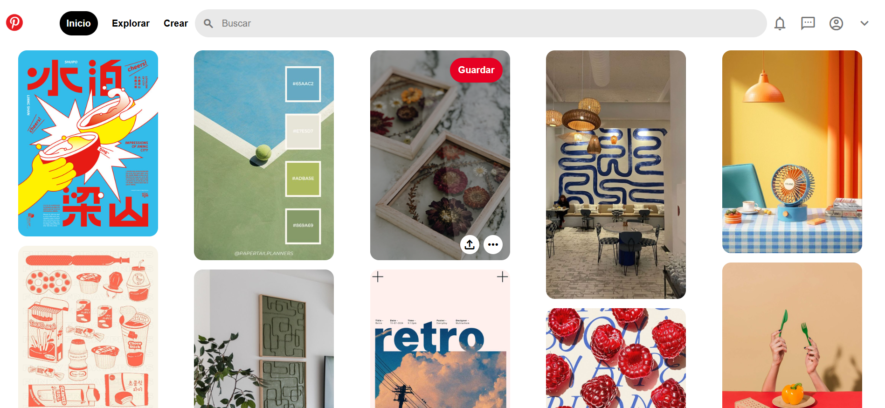

# Portafolio de proyectos

Hola! Soy ***Pau Avilés***, artista digital y desarrolladora frontend Jr. Apasionada por la tecnología, el arte 🎨 y el diseño. Aquí encontrarás información sobre mí.
___
#### El proyecto cuenta con las secciones de:

- 🦾 Habilidades
- 📚 Proyectos
- 🥇 Testimonios
- 📧 Contacto

___
#### Creado con:
- HTML
- CSS
- JavaScript

___

### Vista previa
 

 

### ¿Colaboramos? ¡**Contáctame**, quiero conocerte!
*Correo* [pau.aviles.ok@gmail.com](mailto:pau.aviles.ok@gmail.com)
